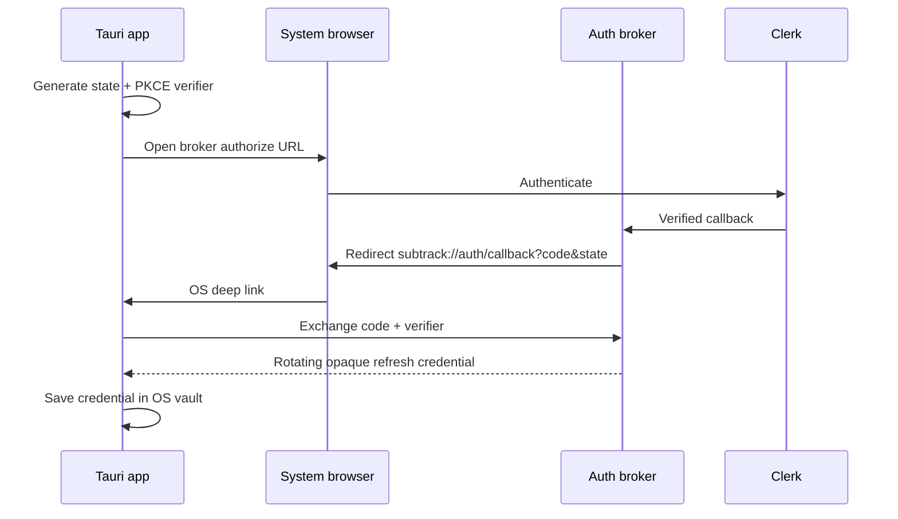

# Clerk + Tauri authentication risk gate

**Status: BLOCKED — implementation boundary exists; credentialed macOS and Windows evidence is
not available. Feature tickets must not treat authentication as proven.**

Windows/Linux callback ingress uses Tauri's single-instance plugin with its `deep-link` feature
registered before the deep-link plugin. The original process receives forwarded URLs, startup URLs
are read with `getCurrent`, and every URL in a delivered batch passes through the state-bound
callback validator. This source boundary still requires packaged Windows evidence below.

## Decision and current spike

The selected persistence facility is macOS Keychain / Windows Credential Manager through Rust's
`keyring` crate. Plaintext web storage and the Tauri store plugin are prohibited. A direct Clerk web
SDK experiment was removed because its session-ID persistence model could not establish secure
restart restoration. The desktop now has one production boundary: the first-party broker exchanges
an authorization code bound to PKCE, keeps its short-lived access token in memory, and rotates an
opaque refresh credential held by the OS vault.

The implemented completion boundary is a small first-party browser-to-app broker using
authorization code plus PKCE:

The broker must consume state and authorization code once, bind them to PKCE, use short expirations,
rotate credentials, revoke on sign-out, and never put Clerk secret keys in the desktop bundle. The
desktop boundary and safe unconfigured state are executable; the broker deployment and credentialed
platform evidence remain release-blocking.

## Configuration

1. In the repository root, copy `.env.example` to `.env.local` and set the exact **HTTPS broker
   base URL**, including the fixed Supabase Edge Function path. The desktop Vite configuration
   explicitly loads this directory. Do not include a query, credential, fragment, or secret.
2. For installer candidates, set the production values in `.env.production.local`, then run
   `npm run release:prepare` and use the generated Tauri config override as described in
   [the release runbook](../releasing.md). It aligns the CSP and restricts the opener to
   `/v1/desktop/authorize` with query parameters; no origin wildcard is granted. For development,
   ensure renderer values and the chosen override point to the same environment.
3. Register `subtrack://auth/callback` for both platform builds and in the broker allowlist.
4. Configure Clerk only on the server-side broker. Use disposable test accounts and never paste
   tokens, codes, email addresses, or Clerk secret keys into logs/issues.

`VITE_*` values are build-time configuration embedded in the desktop bundle. After changing them,
operators must rebuild and reinstall Subtrack; restarting an already packaged app is not enough.

## Required evidence matrix

Run the packaged debug build, not only a browser tab, once on current macOS and once on supported
Windows. Attach redacted timestamps/build hashes; do not attach email addresses, codes, or tokens.

| Scenario                | macOS | Windows | Pass condition                                                          |
| ----------------------- | ----: | ------: | ----------------------------------------------------------------------- |
| Email-code login        |    ⬜ |      ⬜ | Code completes once; wrong/expired/replayed codes fail safely           |
| Restart restore/refresh |    ⬜ |      ⬜ | Valid credential restores after full process exit; no web-storage token |
| Expired/revoked restore |    ⬜ |      ⬜ | App deletes vault state and becomes anonymous                           |
| Sign-out/revocation     |    ⬜ |      ⬜ | Provider session is unusable and keychain entry is absent               |
| System-browser OAuth    |    ⬜ |      ⬜ | Default browser used; correct PKCE/state callback succeeds once         |
| Malformed deep links    |    ⬜ |      ⬜ | Wrong scheme/host/path, extra/missing/oversized args are rejected       |
| Vault inspection        |    ⬜ |      ⬜ | Credential exists only in OS secure storage, never web/files/logs       |

## Exit criteria

The gate can change to PASS only when every cell above has linked, redacted evidence; automated
integration tests cover broker exchange, rotation, expiry, revocation, missing/wrong Clerk role,
issuer/session mismatch, replay, and malformed callbacks; and a reviewer confirms the CSP contains
only the exact required origins.
